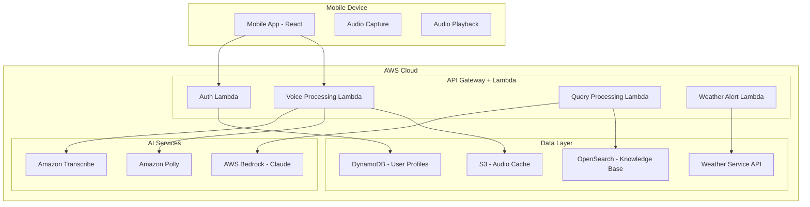

# Design Document: Bharat AI Krishi Saathi

## Overview

Bharat AI Krishi Saathi is a voice-first agricultural assistant designed specifically for rural Indian farmers. The system leverages AWS cloud services to provide multilingual (Tamil/Hindi) voice interactions, intelligent agricultural advice through RAG-based knowledge retrieval, and weather-based alerts optimized for low-bandwidth mobile environments.

The architecture prioritizes accessibility, reliability, and cultural appropriateness, addressing the unique challenges of serving farmers with limited literacy, poor connectivity, and diverse linguistic needs.

## Architecture

### High-Level Architecture



### Component Architecture

The system follows a microservices architecture with the following key components:

1. **Voice Interface Layer**: Handles speech-to-text and text-to-speech processing
2. **Query Processing Layer**: Manages agricultural knowledge retrieval and response generation
3. **Alert System**: Processes weather data and generates farming alerts
4. **Mobile Application**: React-based frontend optimized for rural connectivity
5. **Data Management**: Handles user profiles, knowledge base, and caching

## Components and Interfaces

### 1. Voice Interface Component

**Purpose**: Manages multilingual voice input/output processing

**Key Interfaces**:
```typescript
interface VoiceProcessor {
  transcribeAudio(audioBlob: Blob, language: 'ta' | 'hi'): Promise<TranscriptionResult>
  synthesizeSpeech(text: string, language: 'ta' | 'hi', voice: VoiceProfile): Promise<AudioBuffer>
  detectLanguage(audioBlob: Blob): Promise<LanguageDetection>
  optimizeForBandwidth(audioBlob: Blob): Promise<CompressedAudio>
}

interface TranscriptionResult {
  text: string
  confidence: number
  detectedLanguage: string
  agriculturalTerms: string[]
}

interface VoiceProfile {
  gender: 'male' | 'female'
  speed: 'slow' | 'normal' | 'fast'
  regionalAccent: string
}
```

**Implementation Details**:
- Amazon Transcribe configured for Tamil (ta-IN) and Hindi (hi-IN)
- Custom vocabulary for agricultural terms in both languages
- Audio preprocessing for noise reduction in rural environments
- Adaptive bitrate encoding based on network conditions

### 2. Agricultural Knowledge System

**Purpose**: RAG-based system for retrieving and generating agricultural advice

**Key Interfaces**:
```typescript
interface KnowledgeRetriever {
  searchKnowledge(query: string, context: FarmerContext): Promise<KnowledgeResult[]>
  generateResponse(query: string, retrievedDocs: KnowledgeResult[], language: string): Promise<AgricultureResponse>
  updateKnowledgeBase(documents: AgricultureDocument[]): Promise<void>
}

interface FarmerContext {
  location: GeoLocation
  crops: string[]
  farmSize: number
  season: string
  previousQueries: QueryHistory[]
}

interface AgricultureResponse {
  answer: string
  confidence: number
  sources: string[]
  relatedTopics: string[]
  actionItems: string[]
}
```

**Implementation Details**:
- OpenSearch cluster with agricultural documents indexed by crop, region, season
- AWS Bedrock (Claude-3) for response generation with agricultural context
- Vector embeddings for semantic search of farming practices
- Multi-modal knowledge base supporting text, images, and structured data

### 3. Weather Alert System

**Purpose**: Generates location-specific weather alerts and farming recommendations

**Key Interfaces**:
```typescript
interface WeatherAlertSystem {
  processWeatherData(location: GeoLocation): Promise<WeatherAlert[]>
  generateFarmingRecommendations(weather: WeatherData, crops: string[]): Promise<FarmingRecommendation[]>
  scheduleAlerts(farmer: FarmerProfile, alerts: WeatherAlert[]): Promise<void>
}

interface WeatherAlert {
  type: 'severe_weather' | 'rainfall' | 'temperature' | 'seasonal'
  severity: 'low' | 'medium' | 'high' | 'critical'
  message: string
  actionRequired: boolean
  validUntil: Date
}

interface FarmingRecommendation {
  activity: string
  timing: string
  priority: 'low' | 'medium' | 'high'
  crops: string[]
  explanation: string
}
```

### 4. Mobile Application Component

**Purpose**: React-based frontend optimized for rural mobile usage

**Key Interfaces**:
```typescript
interface MobileApp {
  captureVoiceInput(): Promise<AudioBlob>
  playVoiceResponse(audio: AudioBuffer): Promise<void>
  displayResponse(response: AgricultureResponse): void
  handleOfflineMode(): void
  syncWhenOnline(): Promise<void>
}

interface OfflineManager {
  cacheResponse(query: string, response: AgricultureResponse): void
  getCachedResponse(query: string): AgricultureResponse | null
  getCachedCalendar(): AgriculturalCalendar
}
```

**Implementation Details**:
- Progressive Web App (PWA) for offline capability
- Service Worker for caching agricultural calendar and common responses
- Adaptive UI based on network quality
- Voice-first design with minimal text input requirements

## Data Models

### Core Data Structures

```typescript
// Farmer Profile
interface FarmerProfile {
  id: string
  phoneNumber: string
  preferredLanguage: 'ta' | 'hi'
  location: {
    state: string
    district: string
    coordinates: [number, number]
  }
  farmingProfile: {
    crops: CropInfo[]
    farmSize: number
    farmingType: 'organic' | 'conventional' | 'mixed'
    experienceLevel: 'beginner' | 'intermediate' | 'expert'
  }
  preferences: {
    voiceSpeed: 'slow' | 'normal' | 'fast'
    alertFrequency: 'high' | 'medium' | 'low'
    dataUsageMode: 'unlimited' | 'limited' | 'minimal'
  }
  createdAt: Date
  lastActive: Date
}

// Agricultural Knowledge Document
interface AgricultureDocument {
  id: string
  title: string
  content: string
  category: 'crop_management' | 'pest_control' | 'fertilizer' | 'weather' | 'general'
  crops: string[]
  regions: string[]
  season: string[]
  language: 'ta' | 'hi' | 'en'
  authorityLevel: 'government' | 'research' | 'expert' | 'community'
  lastUpdated: Date
  vectorEmbedding: number[]
}

// Query Processing
interface QuerySession {
  sessionId: string
  farmerId: string
  queries: QueryRecord[]
  startTime: Date
  endTime?: Date
  language: string
  location: GeoLocation
}

interface QueryRecord {
  id: string
  audioInput: string // S3 URL
  transcribedText: string
  processedQuery: string
  response: AgricultureResponse
  audioResponse: string // S3 URL
  timestamp: Date
  processingTime: number
  userFeedback?: 'helpful' | 'not_helpful'
}
```

### Database Schema

**DynamoDB Tables**:

1. **FarmerProfiles** (Primary Key: farmerId)
   - Stores farmer information and preferences
   - GSI on location for regional queries

2. **QuerySessions** (Primary Key: sessionId, Sort Key: timestamp)
   - Tracks conversation history
   - GSI on farmerId for user history

3. **WeatherAlerts** (Primary Key: alertId, Sort Key: location)
   - Stores active weather alerts
   - TTL for automatic cleanup

**OpenSearch Indices**:

1. **agricultural-knowledge-ta** - Tamil agricultural documents
2. **agricultural-knowledge-hi** - Hindi agricultural documents
3. **crop-calendar** - Seasonal farming activities by region

## Correctness Properties

*A property is a characteristic or behavior that should hold true across all valid executions of a system—essentially, a formal statement about what the system should do. Properties serve as the bridge between human-readable specifications and machine-verifiable correctness guarantees.*

Before defining the correctness properties, let me analyze the acceptance criteria to determine which ones are testable as properties.

### Property 1: Multilingual Voice Processing
*For any* valid audio input in Tamil or Hindi containing agricultural content, the voice interface should successfully transcribe the speech to text and convert response text back to speech in the same language with appropriate pronunciation of technical terms.
**Validates: Requirements 1.1, 1.2, 4.1, 4.2, 7.1**

### Property 2: Noise-Resilient Voice Processing  
*For any* audio input with background noise or quality degradation, the voice interface should either successfully process the primary voice input or request repetition with clear feedback to the user.
**Validates: Requirements 1.3, 1.4**

### Property 3: Code-Switching Language Handling
*For any* mixed-language audio input, the system should identify the dominant language and process the input consistently while handling language switches appropriately.
**Validates: Requirements 1.5, 7.2, 7.3**

### Property 4: Domain-Specific Knowledge Retrieval
*For any* agricultural query about crop management, pest control, or fertilizer advice, the knowledge retrieval system should return relevant information prioritized by regional applicability and seasonal relevance.
**Validates: Requirements 2.1, 2.2, 2.3, 2.4**

### Property 5: Graceful Unknown Query Handling
*For any* query that cannot be answered from the knowledge base, the system should inform the user appropriately and suggest alternative resources rather than providing incorrect information.
**Validates: Requirements 2.5**

### Property 6: Weather-Based Alert Generation
*For any* weather condition change (severe weather, rainfall patterns, temperature extremes, or seasonal transitions), the alert system should generate appropriate location-specific alerts and farming recommendations for affected farmers.
**Validates: Requirements 3.1, 3.2, 3.3, 3.4, 3.5**

### Property 7: Audio Response Optimization
*For any* generated text response, the voice interface should break lengthy responses into digestible segments with natural pauses and handle repetition requests with appropriate speed control.
**Validates: Requirements 4.3, 4.4**

### Property 8: Localized Number and Unit Pronunciation
*For any* response containing numbers or measurements, the voice interface should pronounce them using local number systems and appropriate regional units.
**Validates: Requirements 4.5**

### Property 9: UI Interaction Consistency
*For any* user interaction with the mobile app (voice button tap, query processing, response display), the interface should provide appropriate visual feedback, loading indicators, and synchronized multimedia presentation.
**Validates: Requirements 5.2, 5.3, 5.4**

### Property 10: Offline Query Management
*For any* query submitted during poor network connectivity, the mobile app should queue the query and process it when connection is restored, maintaining user experience continuity.
**Validates: Requirements 5.5**

### Property 11: Adaptive Network Optimization
*For any* network condition (limited bandwidth, slow connection, intermittent connectivity), the system should apply appropriate optimizations including audio compression, content prioritization, and intelligent caching.
**Validates: Requirements 6.1, 6.2, 6.3**

### Property 12: Offline Mode Functionality
*For any* offline usage scenario, the mobile app should provide access to cached responses and basic agricultural calendar without requiring network connectivity.
**Validates: Requirements 6.4**

### Property 13: Regional Dialect Recognition
*For any* input using regional dialects of Tamil or Hindi, the system should recognize common variations and respond appropriately using locally understood terminology.
**Validates: Requirements 7.4, 7.5**

### Property 14: Knowledge Base Completeness and Currency
*For any* agricultural topic relevant to Indian farming (crops, pests, diseases, practices), the knowledge base should contain comprehensive, current information that reflects seasonal changes and regional variations.
**Validates: Requirements 8.1, 8.3, 8.4**

### Property 15: Knowledge Base Update Capability
*For any* new agricultural research or information, the system should allow structured ingestion and updates to the knowledge base while prioritizing scientifically validated sources.
**Validates: Requirements 8.2, 8.5**

### Property 16: Personalized Context-Aware Advice
*For any* returning farmer with established profile, the system should recognize them, load their farming context, and provide personalized advice based on their crops, location, and history.
**Validates: Requirements 9.2, 9.3**

### Property 17: Personalized Notification Scheduling
*For any* seasonal transition or farming activity deadline, the system should send personalized notifications based on the farmer's specific crops and location.
**Validates: Requirements 9.4**

### Property 18: Privacy-Preserving Usage
*For any* farmer concerned about privacy, the system should allow usage of core functionality without requiring detailed profile creation.
**Validates: Requirements 9.5**

### Property 19: Response Time Performance
*For any* voice query submitted under normal or high-load conditions, the system should process and respond within specified time limits (10 seconds normal, 15 seconds for 95% under load).
**Validates: Requirements 10.1, 10.2**

### Property 20: Graceful Error Handling
*For any* AWS service failure or system error, the system should handle the error gracefully and provide meaningful feedback to farmers without exposing technical details.
**Validates: Requirements 10.3**

### Property 21: Critical Alert Delivery Performance
*For any* critical weather alert, the system should deliver notifications to affected farmers within 5 minutes of receiving updated weather data.
**Validates: Requirements 10.4**

### Property 22: Maintenance Impact Minimization
*For any* required system maintenance, advance notice should be provided and service disruption should be minimized during peak farming hours.
**Validates: Requirements 10.5**

## Error Handling

### Voice Processing Errors
- **Audio Quality Issues**: When audio quality is insufficient for transcription, request repetition with specific guidance
- **Language Detection Failures**: Fall back to user's preferred language setting when automatic detection fails
- **Transcription Confidence**: Reject transcriptions below confidence threshold and request clarification

### Knowledge Retrieval Errors
- **No Matching Results**: Provide graceful fallback with general agricultural resources and contact information
- **Ambiguous Queries**: Ask clarifying questions to narrow down the farmer's specific need
- **Outdated Information**: Flag potentially outdated advice and suggest consulting local agricultural extension officers

### Network and Connectivity Errors
- **Offline Mode**: Seamlessly switch to cached content and queue new queries
- **Partial Connectivity**: Prioritize essential data transmission and defer non-critical content
- **Service Timeouts**: Implement exponential backoff with user-friendly progress indicators

### Weather Service Errors
- **API Failures**: Fall back to cached weather data with appropriate staleness warnings
- **Location Errors**: Use approximate location based on user profile when GPS is unavailable
- **Alert Delivery Failures**: Implement retry mechanisms with escalating notification channels

## Testing Strategy

### Dual Testing Approach

The system requires both unit testing and property-based testing for comprehensive coverage:

**Unit Tests** focus on:
- Specific examples of voice processing with known agricultural terms
- Integration points between AWS services (Transcribe, Polly, Bedrock)
- Edge cases like empty queries, malformed audio, or network timeouts
- Error conditions and fallback behaviors
- UI component interactions and state management

**Property-Based Tests** focus on:
- Universal properties that hold across all valid inputs
- Comprehensive input coverage through randomization
- Voice processing accuracy across diverse audio samples
- Knowledge retrieval consistency across different query types
- Performance characteristics under varying load conditions

### Property-Based Testing Configuration

**Framework**: Use **fast-check** for JavaScript/TypeScript property-based testing
**Configuration**: Minimum 100 iterations per property test
**Tagging**: Each property test must reference its design document property

Example test structure:
```typescript
// Feature: bharat-ai-krishi-saathi, Property 1: Multilingual Voice Processing
fc.assert(fc.property(
  fc.record({
    audio: validAudioSample(),
    language: fc.constantFrom('ta', 'hi'),
    agriculturalTerms: fc.array(agriculturalTerm())
  }),
  (input) => {
    const result = voiceProcessor.transcribe(input.audio, input.language);
    return result.language === input.language && 
           containsAgriculturalTerms(result.text, input.agriculturalTerms);
  }
), { numRuns: 100 });
```

### Integration Testing Strategy

**End-to-End Voice Flows**:
- Complete voice query processing from audio input to audio response
- Multi-turn conversations with context preservation
- Language switching scenarios within conversations

**AWS Service Integration**:
- Transcribe service with custom agricultural vocabulary
- Polly service with regional voice profiles
- Bedrock integration with agricultural knowledge context
- OpenSearch queries with vector similarity matching

**Mobile App Testing**:
- Progressive Web App functionality across different devices
- Offline mode transitions and data synchronization
- Network condition adaptations and performance optimization

**Load and Performance Testing**:
- Concurrent user scenarios during peak farming seasons
- Network bandwidth variations typical of rural connectivity
- Response time validation under different system loads

### Test Data Management

**Agricultural Knowledge Corpus**:
- Curated dataset of Tamil and Hindi agricultural content
- Regional variations in farming practices and terminology
- Seasonal farming calendars for different crop cycles

**Voice Sample Library**:
- Diverse speaker recordings in Tamil and Hindi dialects
- Agricultural terminology pronunciation variations
- Background noise samples typical of rural environments

**Weather Data Simulation**:
- Historical weather patterns for different Indian regions
- Extreme weather event scenarios for alert testing
- Seasonal transition patterns for recommendation validation

## Security Architecture

### Authentication and Authorization
- **JWT-based Authentication**: Secure farmer session management with token-based authentication
- **IAM Role-based Access**: AWS services accessed through least-privilege IAM roles
- **API Security**: All API calls secured via HTTPS with API Gateway authentication

### Data Protection
- **Encryption at Rest**: All stored data encrypted in S3, DynamoDB, and OpenSearch
- **Encryption in Transit**: TLS 1.2+ for all data transmission
- **Minimal PII Storage**: Optional anonymous usage mode with minimal personal data collection
- **Voice Data Privacy**: Audio recordings encrypted and automatically purged after processing

### Access Control
- **Service-to-Service**: AWS service mesh with VPC endpoints for internal communication
- **Rate Limiting**: API Gateway throttling to prevent abuse and ensure fair usage
- **Geographic Restrictions**: Optional geo-fencing for India-specific deployment

## Scalability Strategy

### Auto-Scaling Infrastructure
- **AWS Lambda**: Serverless compute ensures automatic scaling based on demand
- **API Gateway**: Handles traffic spikes with built-in throttling and caching
- **DynamoDB**: On-demand capacity mode scales automatically with usage patterns

### Data Layer Scaling
- **OpenSearch**: Horizontal scaling for large agricultural knowledge corpus
- **S3**: Unlimited storage for audio files and knowledge documents
- **CloudFront CDN**: Global content delivery for mobile app assets and cached responses

### Performance Optimization
- **Regional Deployment**: Multi-region setup for reduced latency across India
- **Caching Strategy**: Multi-layer caching (CloudFront, API Gateway, application-level)
- **Connection Pooling**: Optimized database connections for high-throughput scenarios

## Alignment with AWS AI for Bharat Vision

Bharat AI Krishi Saathi directly supports the AI for Bharat initiative by:

### Inclusive AI Access
- **Regional Language Support**: Native Tamil and Hindi voice interactions remove language barriers
- **Voice-First Design**: Enables AI access for farmers with limited literacy
- **Rural Connectivity Optimization**: Designed for low-bandwidth, intermittent connectivity scenarios

### Leveraging AWS AI Services
- **AWS Bedrock**: Advanced language models for agricultural knowledge processing
- **Amazon Transcribe**: Multilingual speech recognition with custom agricultural vocabulary
- **Amazon Polly**: Natural-sounding voice synthesis in regional languages
- **OpenSearch**: Semantic search capabilities for agricultural knowledge retrieval

### Sustainable Development Impact
- **Climate-Smart Agriculture**: Weather-based alerts and recommendations support climate resilience
- **Knowledge Democratization**: Equal access to agricultural expertise regardless of location or literacy
- **Scalable Rural Deployment**: Serverless architecture enables cost-effective scaling to millions of farmers
- **Digital Inclusion**: Bridges the digital divide by making AI accessible through voice interfaces

### Economic Empowerment
- **Improved Crop Yields**: Data-driven agricultural advice helps increase farmer productivity
- **Reduced Input Costs**: Optimized fertilizer and pest management recommendations
- **Market Access**: Integration potential with agricultural marketplaces and supply chains
- **Skill Development**: Continuous learning through AI-powered agricultural education